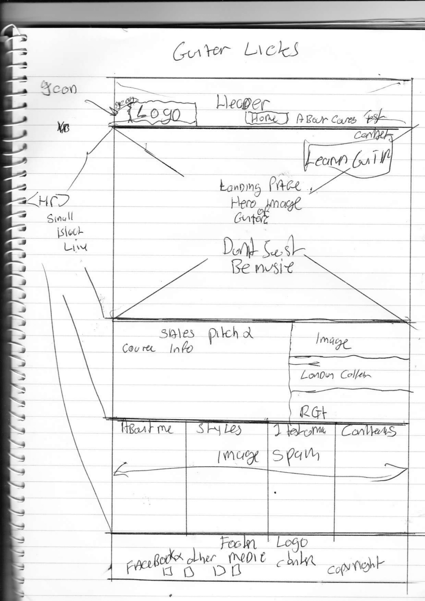
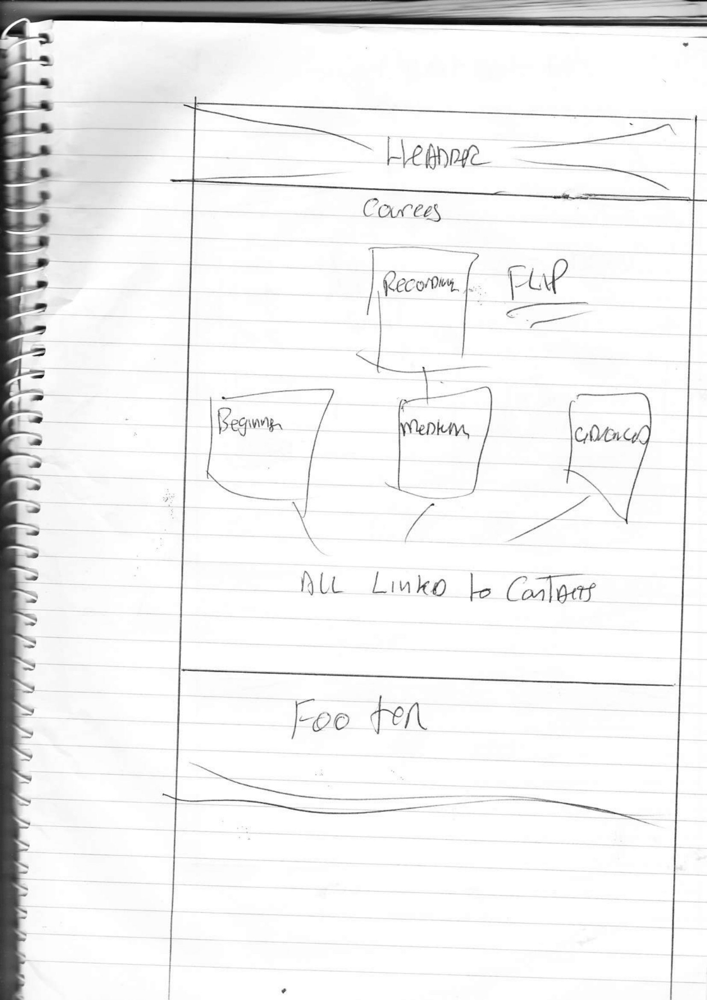
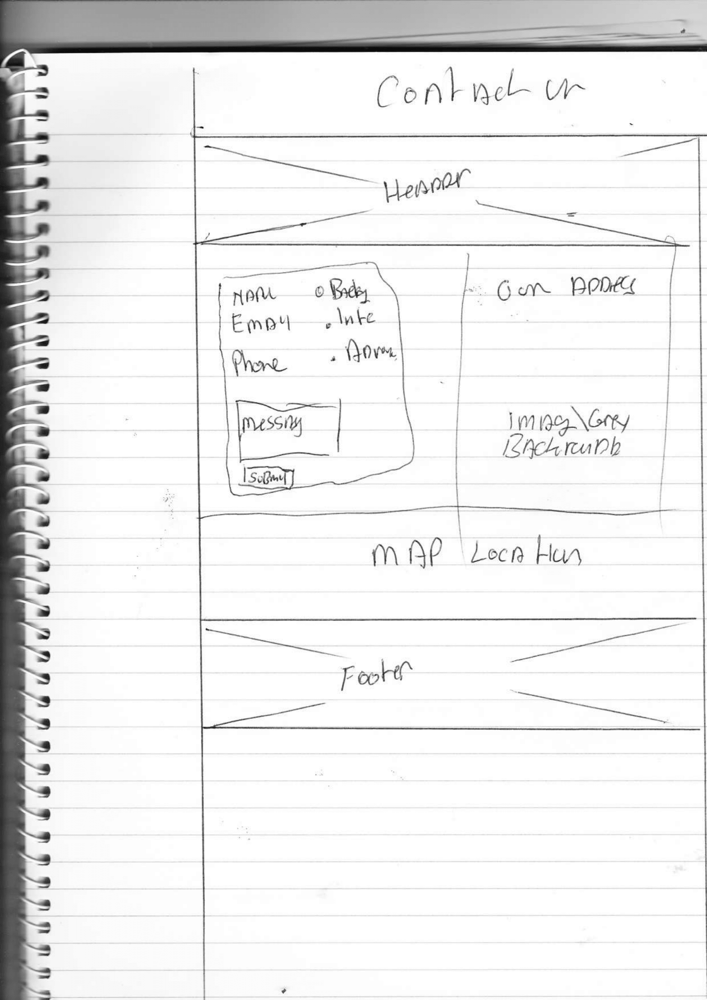

<h1>Project 1: - Guitar licks, Guitar Tuition Web Site.</h1> Initial Start 09/01/2023

1.0 Day 1 Created page with head\metadata tags, directory’s and files (assets/css), boiler plate with accessibility in mind and also font experimentation. 09/01/2023

1.1 Day 2  Created headder with nav icons that shadow when chosen with .9 sec transition 10/01/23

Thanks to : https://freshman.tech/flexbox-navbar/ Flexbox

Help for github image add https://www.youtube.com/watch?v=hHbWF1Bvgf4&ab_channel=TanUv90

<figure>
  
  <figcaption>Rough Sketch Landing Page</figcaption>
</figure>
<figure>
  
  <figcaption>Rough Sketch Cources Page</figcaption>
</figure>
<figure>
  
  <figcaption>Rough Sketch Contacts Page</figcaption>
</figure>

