<figure>
  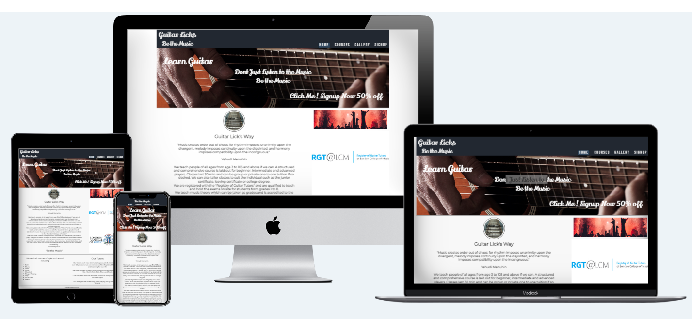
</figure>

<h1>Project 1: - Guitar licks, Guitar Tuition Web Site. "Be The Music"</h1> 

Guitar Licks website offers people of all ages to pick up a guitar and be part of the music. The site is tailored with three main teaching courses to accommodate the beginner, intermediate and advanced player with the added bonus of live performance solo or with a band. The site is intended to offer a not just a place to take lessons but to be part of a developing community of budding new and old musicians, providing contacts and a map area to assist location us.   
The sites courses are structured and gradually build the players confidence whilst learning and providing essential techniques and music theory to back it up. On the courses page players are given full details of the course material in order to assist them make the correct choice.   
Players are encouraged through the site to sign up at a massive 50% discount. This then guides them to the signup area where they can leave there details and be contacted at a later date to be assessed and assigned a suitable tutor and course. 

<h1>Features</h1>

- __Navigation Bar__ 

  - On all four pages there is a fully responsive Navigation Bar includes links to the Home page, Courses, Gallery and Sign Up area. The Navigation Bar is identical in each page to allow for easy navigation.

  - It will allow the user to easily navigate from page to page across all devices without having to revert back to the previous page via the ‘back’ button. 
  
  - When a user is active on a page they are given feedback with a highlighed nav button to guide them on which page they have activaed. 
<figure>
  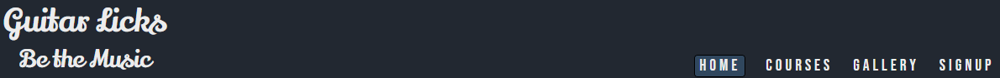
</figure>

- __The landing page image__

  - The main page includes a photograph of a playing guitar with a responsive text overlay featuring a 50% discount. 
  - The responsive text draws the guitar player towards the signing page by link of the "Click Me" text to navigate.  

<figure>
  
</figure>

- __Guitar Licks Ethos__

  - The Main text area supply’s the guitarist with an overview of how we think and how we can assist in further education the budding talent. 

  - The responsive text draws the guitar player towards the signing page by link of the "Click Me" text to navigate.  

  - Included in the page are two primary prestigious accreditations for Registry of Guitar Tutors and London College of Music. 

<figure>
  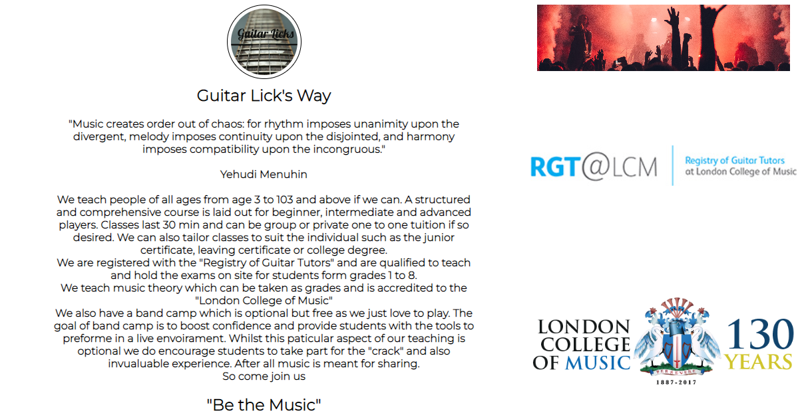
</figure>

- __Testimonial Area__

  - Here we supply comments and testimonials from past students.

<figure>
  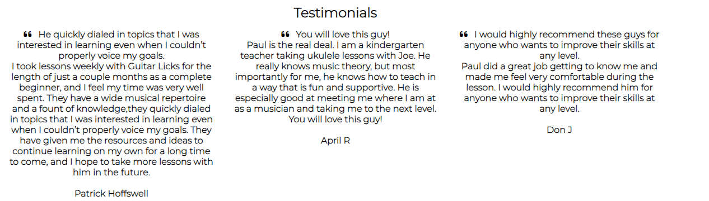
</figure>

- __Footer__
  - The address information is included at the bottom of the page situated above the footer which will help the player to send us an email or call.
  - The footer section includes links to social media such as Facebook, Twitter YouTube and Instagram. 
  - The links will open to a new tab to allow easy navigation for the Guitarist.
  - This is essential as it encourages the students to keep connected via social media for upcoming gigs and open workshops.
 

<figure>
  
</figure>

- __Syllabus__

  - The syllabus section has each level of tuition clearly stated. 
  - The details of each course are held on 3 cards that are responsive for all sizes of screen.
  - Each card is comprehensively detailed to give the guitarist a thorough indication of the learning journey. 
  - A "Sign me up" button at the end of each card can easily navigate the player to the signup area. 
<figure>
  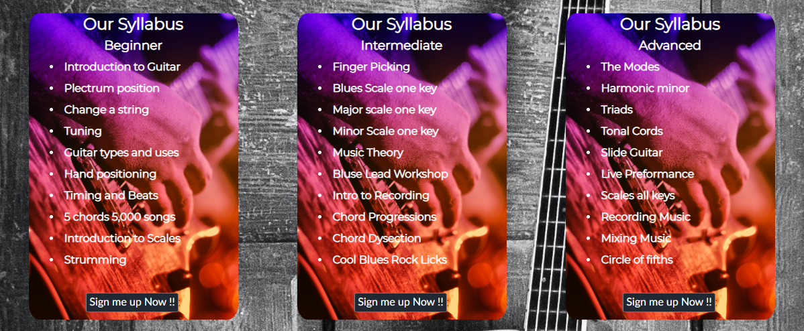
</figure>

- __Gallery__

- The gallery page includes images of previous gigs and concerts that will inspire the player to "Be THe Music"

<figure>
  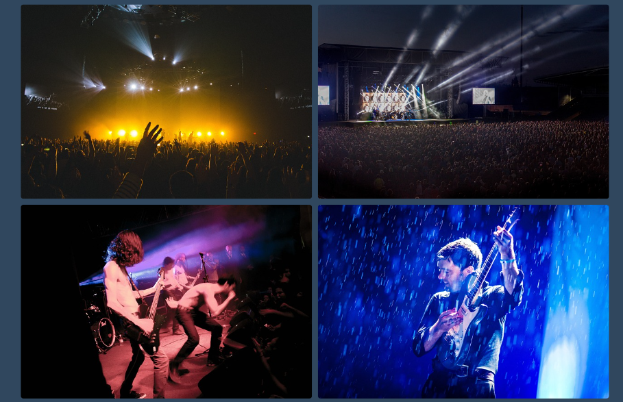
</figure>

- __Contacts Page__

  - The contacts page has a form wit First Name, Last Name, Email Address, Phone Number and message area.
  - Also Vertical radio buttons dictating the entry level of the student, Beginner Intermediate of Advanced. 
  - The student will then be contacted by one of our assessor to determine the correct course and any other needs of the potential student.  

<figure>
  
</figure>

- __Contacts Page__ 

  - A map section with the studio pined is inclduded with the address on the contents page above the footer.  

<figure>
  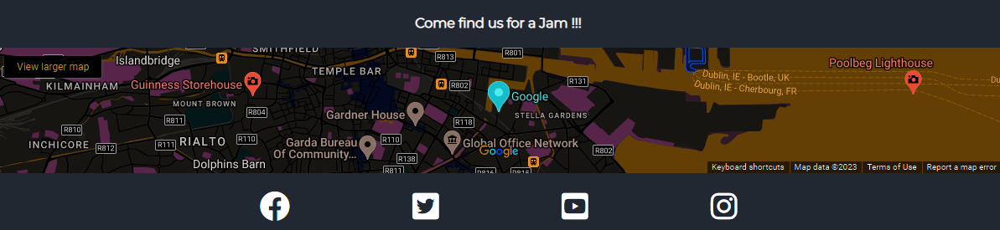
</figure>

## <h1>Testing</h1> 

  - Guitar Licks --- HTML code has been tested and passed. 
  - Guitar Licks --- All CSS code has been tested and passed.

### Validator Testing 

- HTML index.html
  - Guitar Licks ---- no errors were returned when passing through the official [W3C validator](https://validator.w3.org/nu/?doc=https%3A%2F%2Fshaga-matula.github.io%2Fguitar-licks%2F)

  
- HTML courses.html
  - Guitar Licks ---- no errors were returned when passing through the official [W3C validator](https://validator.w3.org/nu/?doc=https%3A%2F%2Fshaga-matula.github.io%2Fguitar-licks%2Fcourses.html)

- HTML gallery.html
  - Guitar Licks ---- no errors were returned when passing through the official [W3C validator](https://validator.w3.org/nu/?doc=https%3A%2F%2Fshaga-matula.github.io%2Fguitar-licks%2Fcourses.html)

- CSS
  - Guitar Licks ---- no errors were found when passing through the official [(Jigsaw) validator](https://jigsaw.w3.org/css-validator/validator?uri=https%3A%2F%2Fshaga-matula.github.io%2Fguitar-licks%2F&profile=css3svg&usermedium=all&warning=1&vextwarning=&lang=en)

## <h1>Design</h1> 

### Inital Sketch  :-  A rough sketch was performed to get the basic layout of the page using pen and paper
- __Home Page__  Rough sketch
- __Syllabus Page__ Rough sketch
- __Contacts Page__ Rough sketch

  <figure>
  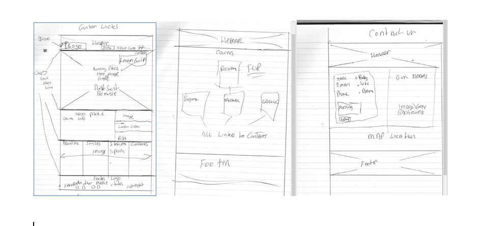
</figure>

- __Figma__ was used to layout the draft from sketch

- Main landing page was designed using figma 
      <figure>
      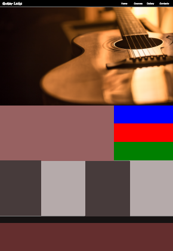
      </figure>

  - Syllabus page was designed using figma 
  <figure>
    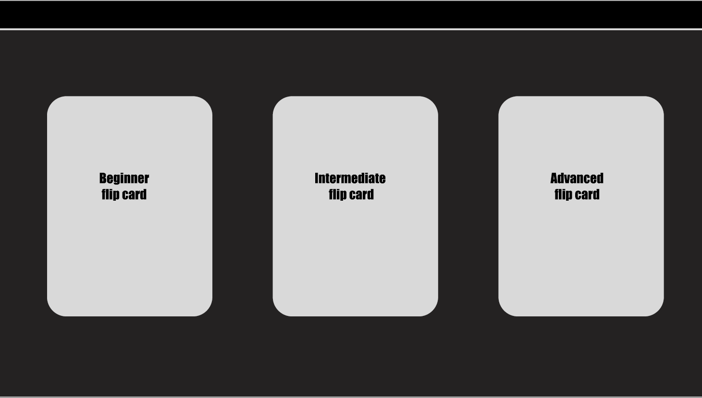
  </figure>

 - Contacts page was designed using figma 

    <figure>
      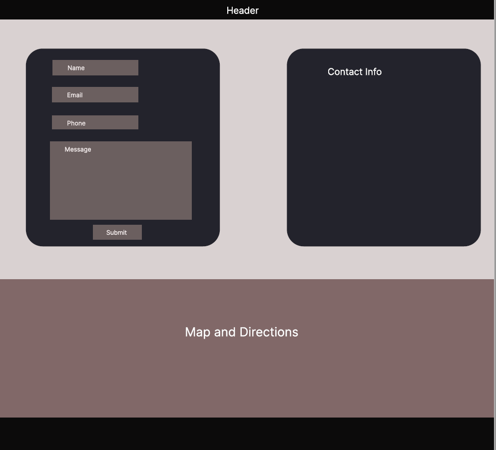
    </figure>

  - Smartphone view was designed using figma 
 
    <figure>
      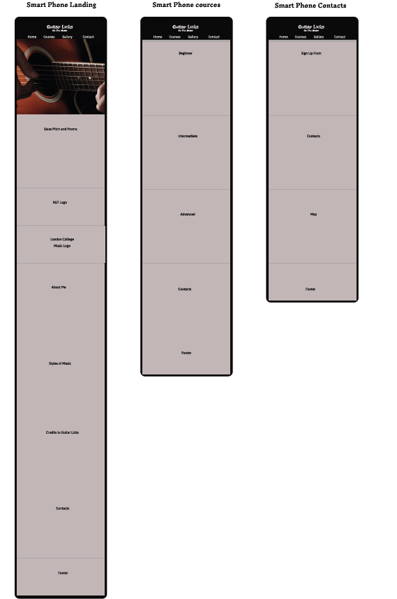
    </figure>