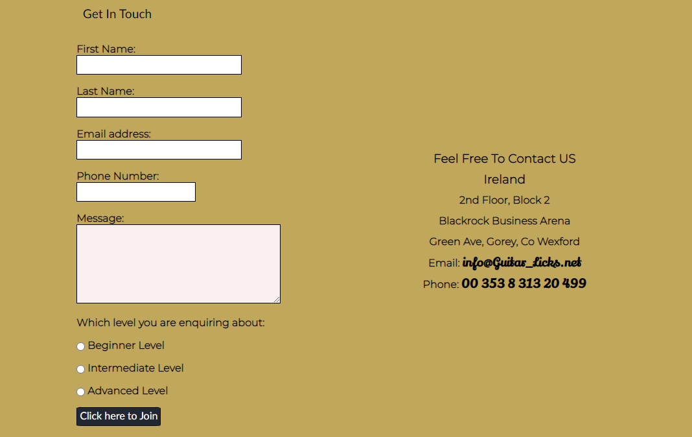

<figure>
  
</figure>

<h1>Project 1: - Guitar licks, Guitar Tuition Web Site. "Be The Music"</h1> 

Guitar Licks website offers people of all ages to pick up a guitar and be part of the music. The site is tailored with three main teaching courses to accommodate the beginner, intermediate and advanced player with the added bonus of live performance solo or with a band. The site is intended to offer a not just a place to take lessons but to be part of a developing community of budding new and old musicians, providing contacts and a map area to assist location us.   
The sites courses are structured and gradually build the players confidence whilst learning and providing essential techniques and music theory to back it up. On the courses page players are given full details of the course material in order to assist them make the correct choice.   
Players are encouraged through the site to sign up at a massive 50% discount. This then guides them to the signup area where they can leave there details and be contacted at a later date to be assessed and assigned a suitable tutor and course. 

<h1>Features</h1>

- __Navigation Bar__ 

  - On all four pages there is a fully responsive Navigation Bar includes links to the Home page, Courses, Gallery and Sign Up area. The Navigation Bar is identical in each page to allow for easy navigation.

  - It will allow the user to easily navigate from page to page across all devices without having to revert back to the previous page via the ‘back’ button. 
  
  - When a user is active on a page they are given feedback with a highlighed nav button to guide them on which page they have activaed. 
<figure>
  
</figure>

- __The landing page image__

  - The main page includes a photograph of a playing guitar with a responsive text overlay featuring a 50% discount. 
  - The responsive text draws the guitar player towards the signing page by link of the "Click Me" text to navigate.  

<figure>
  
</figure>

- __Guitar Licks Ethos__

  - The Main text area supply’s the guitarist with an overview of how we think and how we can assist in further education the budding talent. 

  - The responsive text draws the guitar player towards the signing page by link of the "Click Me" text to navigate.  

  - Included in the page are two primary prestigious accreditations for Registry of Guitar Tutors and London College of Music. 

<figure>
  
</figure>

- __Testimonial Area__

  - Here we supply comments and testimonials from past students.

<figure>
  
</figure>

- __Footer__
  - The address information is included at the bottom of the page situated above the footer which will help the player to send us an email or call.
  - The footer section includes links to social media such as Facebook, Twitter YouTube and Instagram. 
  - The links will open to a new tab to allow easy navigation for the Guitarist.
  - This is essential as it encourages the students to keep connected via social media for upcoming gigs and open workshops.
 

<figure>
  
</figure>

- __Syllabus__

  - The syllabus section has each level of tuition clearly stated. 
  - The details of each course are held on 3 cards that are responsive for all sizes of screen.
  - Each card is comprehensively detailed to give the guitarist a thorough indication of the learning journey. 
  - A "Sign me up" button at the end of each card can easily navigate the player to the signup area. 
<figure>
  
</figure>

- __Gallery__

- The gallery page includes images of previous gigs and concerts that will inspire the player to "Be THe Music"

<figure>
  
</figure>

- __Contacts Page__

  - The contacts page has a form wit First Name, Last Name, Email Address, Phone Number and message area.
   
  - The student will then be contacted by one of our assessor to determine the correct course and any other needs of the potential student. 
  
    * The contact form is implemented to allow users to contact 'Guitar Licks'. These are the feields: 
        * First Name (required, type=text)
        * Last Name (required, type=text)
        * Email (required, type=email)
        * Message (required, type=textarea)

  - Also Vertical radio buttons dictating the entry level of the student, Beginner Intermediate of Advanced.
    

<figure>
  
</figure>

  - Testing of raido buttons, all testing was successful and no errors were produced.  

<figure>
  
</figure>

  - A map section with the studio pined is inclduded with the address on the contents page above the footer.
  - The map was set to night vision for colors.   

<figure>
  
</figure>

## <h1>Design</h1> 

### Inital Sketch  :-  A rough sketch was performed to get the basic layout of the page using pen and paper
- __Home Page__  Rough sketch
- __Syllabus Page__ Rough sketch
- __Contacts Page__ Rough sketch

  <figure>
  
</figure>

- __Figma__ was used to layout the draft from sketch

- Main landing page was designed using figma 
      <figure>
      
      </figure>

  - Syllabus page was designed using figma 
  <figure>
    
  </figure>

 - Contacts page was designed using figma 

    <figure>
      
    </figure>

  
  - Smartphone view was designed using figma 
 
    <figure>
      
    </figure>

    ### Color Palette
    
    <figure>
      
      <figcaption>Color Pallet Used</figcaption>
    </figure>

    ## <h1>Deployment</h1> 
   
  * The site was deployed to GitHub pages. the steps to deploy are as follows: 
  * In the GitHub repository, navigate to the settings tab
  * Select the pages link from the setting menu on the left hand side 
  * Under the GitHub Pages from the source section drop-down menu, select the master branch 
  * One the master branch has been selected, the page will be automatically refreshed with a detailed ribbon display to indicate the successful deployment. 
    - The live link can be found here - [Guitar Licks](https://shaga-matula.github.io/guitar-licks/index.html)

## <h1>Technologies</h1>

* HTML
    * The Website was developed using HTML.
* CSS
    * The Website was styled using custom CSS in a seperate file located in assets/css.
* Visual Studio Code
    * The website was developed using Visual Studio Code.
* GitHub
    * Code is stored on GitHub and delpoyed using Git Pages.
* Git 
    * Git commit and Git push along with Git add . were the commands for github.
* Font Awesome
    * All Icons obtained from https://fontawesome.com/ used in the footer section for social media links. 
* Tinyjpg
    * https://tinyjpg.com/ used tinyjpg toreduce the size of the images.
* Figma
    * https://www.figma.com/ Figma is the main design app used forthe site. 

  ## <h1>Testing</h1> 

### Responsiveness

Every pages was tested for responsiveness on screen sizes from 320px and upwards on Chrome, Edge, Firefox and Opera browsers.

* Manual steps to test:

  - Open the browser and navigate to [Guitar Licks](https://shaga-matula.github.io/guitar-licks/)
  - Open dev tools (right click and inspect)
  - Set to responsive and decrease width to 320px
  - Set the zoom to 50%
  - Click and drag the responsive window to maximum width

### Issue:- Nav menu did not fit accross smaller 320px screen, icons were wrapping.
  - Fix: Set @media for less than 320px and reduced padding on Nav bar to allow inline deployment.  
  - All further tests performed were scussful. 
### Issue:- At 320px screen, message area bleeding to right.

  - Fix :- Message area before bug fix.
  <figure>
      
      <figcaption>Display of area before bug fix</figcaption>
      </figure>
  - Fix :- First identify code for area.
  <figure>
      
      <figcaption>Code snapshot bug before bug fix</figcaption>
      </figure>

  - Fix :- Alter code for area to allow for growth and max width.
  <figure>
    
    <figcaption>Code snapshot after bug fix</figcaption>
    </figure>
  
  - Fix :- Message area after bug fix
  <figure>
    
    <figcaption>Display of area after bug fix</figcaption>
    </figure>
  
  - Tested area and error has disapated. 

  - All further tests performed were scussful. 

### Validator Testing 

  - Guitar Licks --- HTML code has been tested and passed. 
  - Guitar Licks --- All CSS code has been tested and passed.

      - HTML index.html
        - Guitar Licks ---- no errors were returned when passing through the official [W3C validator](https://validator.w3.org/nu/?doc=https%3A%2F%2Fshaga-matula.github.io%2Fguitar-licks%2F)

      - HTML courses.html
        - Guitar Licks ---- no errors were returned when passing through the official [W3C validator](https://validator.w3.org/nu/?doc=https%3A%2F%2Fshaga-matula.github.io%2Fguitar-licks%2Fcourses.html)

      - HTML gallery.html
        - Guitar Licks ---- no errors were returned when passing through the official [W3C validator](https://validator.w3.org/nu/?showsource=yes&doc=https%3A%2F%2Fshaga-matula.github.io%2Fguitar-licks%2Fgallery.html#cl12c12)

      - HTML signup.html
        - Guitar Licks ---- no errors were returned when passing through the official [W3C validator](https://validator.w3.org/nu/?doc=https%3A%2F%2Fshaga-matula.github.io%2Fguitar-licks%2Fsignup.html#cl12c12)

      - CSS
        - Guitar Licks ---- no errors were found when passing through the official [(Jigsaw) validator](https://jigsaw.w3.org/css-validator/validator?uri=https%3A%2F%2Fshaga-matula.github.io%2Fguitar-licks%2F&profile=css3svg&usermedium=all&warning=1&vextwarning=&lang=en)

### Wave Testing
  - Issue :- Getting very bad contrast from backround image on main landing page. I converted the backround image to black and white and gave it a backround of black. 
  - Issue :- On Syllabus page there were over 30 contrast errors, again it was the background color needed changing to black.
  - Issue :- There is one warning that will not go away as I have made the logo into a link and its complaining about nav bar link as a duplicate (long time figuring out that). 

  <figure>
  
    <figcaption>Landing Page-Wave</figcaption>
  </figure>
  
  <figure>
  
    <figcaption>Syllabus Page-Wave</figcaption>
  </figure>
  
  <figure>
  
    <figcaption>Gallery Page-Wave</figcaption>
  </figure>
  
  <figure>
  
    <figcaption>Landing Page Wave</figcaption>
  </figure>
  
  
  
  ## <h1>Credits</h1>

  ### Content  

  * The text for all other pages was created by me. 
  * The reference material on HTML and CSS provided by [w3schools.com](https://www.w3schools.com/) was used to help with coding. 
  * Footer were from [Font Awesome](https://fontawesome.com/)

  ### Media 
  * The images used for hero image are free open sourse from (https://www.pexels.com/)

